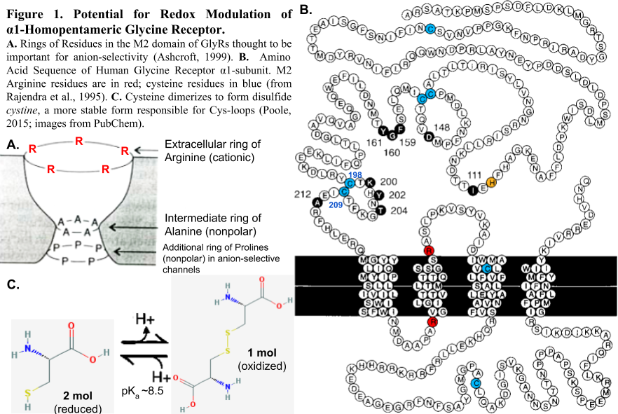
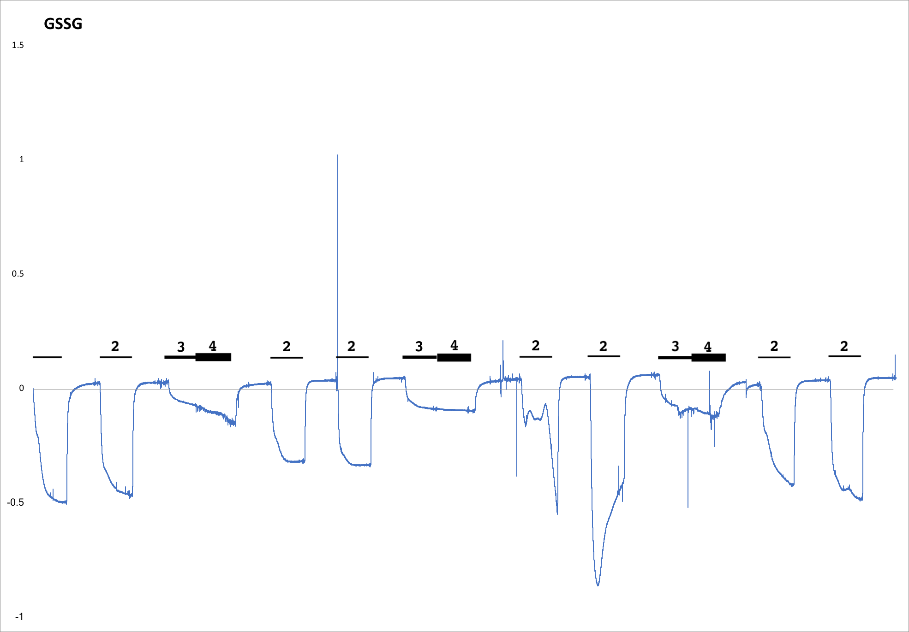
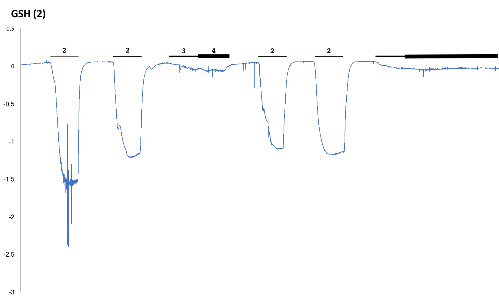

```{r setup, include=FALSE}
# These are some {knitr} options I typically use to format my ***RMarkdown*** documents in a consistent way
# You should feel free to alter these or use other "chunk options" as you see fit!
# Sometimes, for example, you might want to suppress warnings or
# messages, and that behavior can be set for specific code chunks in
# the chunk header, e.g., ```{r warning = FALSE, echo = FALSE}
knitr::opts_chunk$set(
  eval = TRUE, # run code in code chunks
  echo = TRUE, # render output of code chunks
  warning = TRUE, # do suppress "warnings"
  message = TRUE, # do suppress "messages"
#  comment = "##", # prefix for comment lines
#  prompt = ">", # prefix for code lines
  tidy = TRUE,
  tidy.opts = list(blank = FALSE, width.cutoff = 100),
  fig.path = "images/", # name of folder for images
  fig.align = "center" # centers any images on the page
)
```

# Electrophysiology: Redox Modulation of Homopentameric $\alpha$-1 Glycine Receptor using Glutathione Disulfide (GSSG) and Glutathione (GSH)\
```{r preliminaries, message=FALSE, warning=FALSE}
require(tidyverse)
require(tidyr)
require(knitr)
require(dplyr)
require(ggplot2)
require(gganimate)
# from github
# devtools::install_github("marcusvolz/mathart")
# require(mathart)
# devtools::install_github("cutterkom/generativeart")
# require(generativeart)
require(aRtsy)
```

## Background on data\
```{r echo=FALSE, out.width="100%", message=FALSE}
 # context
```


## **GSSG** Oxidation\
**LOSS OF ELECTRONS = OXIDATION**:    $X^+ - e^- = Xº$\
```{r echo=FALSE, out.width="100%", message=FALSE}
 # full trace with treatment regimen
```
1. **Control** Ephys Recording Solution (ND)\
2. **Positive Control:** 50µM Glycine in ND\
3. **Pre-treatment:** 5mM GSSG in ND\
4. **Co-Application** 50µM Glycine + 5mM GSSG in ND\

**load GSSG data**
```{r gssg oxidation dataset}
f1 <- "https://raw.githubusercontent.com/slcornett/creative-data-visualization/main/data/2018-04-05_GSSG_Oxidation.csv"
gssg <- read_csv(f1,  col_names = TRUE)
gssg <- gssg %>% filter(time_s >=1000, time_s<=2000) # make it slightly less giant
head(gssg)
```

### **GSSG** Trace Plots\
```{r gssg visualizations}
# static plot
gssg_p1 <- ggplot(data = gssg, aes(x = time_s, y = GSSG_Current_µA, color = GSSG_Current_µA)) +
  scale_color_continuous(type = "viridis") +
  geom_line(show.legend = FALSE) +
  ggtitle("Oxidative Effect of GSSG on Glycine-Receptor") +
  theme_classic()
gssg_p1

# animated! like a heart beat
gssg_a1 <- ggplot(data = gssg, aes(x = time_s, y = GSSG_Current_µA, color = GSSG_Current_µA)) +
  scale_color_continuous(type = "viridis") +
  geom_jitter(show.legend = FALSE) +
  ggtitle("Oxidative Effect of GSSG on Glycine-Receptor") + 
  theme_classic() +
  labs(x = "time (s): {frame_time}", y = "Current uA") +
  # gganimate
  transition_time(time = gssg$time_s) +
  shadow_wake(wake_length = 0.2, alpha = FALSE) +
  ease_aes('linear')
gssg_a1

# with a trace 
gssg_a2 <- ggplot(data = gssg, aes(x = time_s, y = GSSG_Current_µA, color = GSSG_Current_µA)) +
  scale_color_continuous(type = "viridis") +
  geom_jitter(show.legend = FALSE) +
  ggtitle("Oxidative Effect of GSSG on Glycine-Receptor") + 
  theme_classic() +
  labs(x = "time (s): {frame_time}", y = "Current µA") +
  # gganimate
  transition_time(time = gssg$time_s) +
  shadow_wake(wake_length = 0.1, alpha = FALSE) +
  shadow_mark(alpha = 0.3, size = 1) +
  ease_aes('linear')
gssg_a2
# adding the absolute value to plot bot the current and absolute value of the current together 
# because i bet it would look very cool
gssg <- gssg %>% mutate("abGSSG_Current_µA" = abs(GSSG_Current_µA)) 
 #gather(key = "Current", value = "value", abGSSG_Current_µA ) # collapses 2 variables into key-value pairs
head(gssg) # cool absolute value present in the dataset

# try to plot two traces on the same plot
# static
gssg_p2 <- ggplot(data = gssg, aes(x = time_s)) +
  geom_line(aes(y = GSSG_Current_µA, color = GSSG_Current_µA), show.legend = FALSE) +
  geom_line(aes(y = abGSSG_Current_µA, color = abGSSG_Current_µA), show.legend = FALSE) +
  scale_color_continuous(type = "viridis") +
  ggtitle("Oxidative Effect of GSSG on Glycine-Receptor") + 
  theme_classic() +
  labs(x = "time (s)", y = "Current µA")
gssg_p2
# animated line
gssg_a3 <- ggplot(data = gssg, aes(x = time_s)) +
  geom_jitter(aes(y = GSSG_Current_µA, color = GSSG_Current_µA), show.legend = FALSE) +
  geom_jitter(aes(y = abGSSG_Current_µA, color = abGSSG_Current_µA), show.legend = FALSE) +
  scale_color_continuous(type = "viridis") +
  ggtitle("Oxidative Effect of GSSG on Glycine-Receptor") + 
  theme_classic() +
  labs(x = "time (s): {frame_time}", y = "Current µA") +
  # gganimate
  transition_time(time = gssg$time_s) +
  shadow_wake(wake_length = 0.1, alpha = FALSE) +
  shadow_mark(alpha = 0.3, size = 1) +
  ease_aes('linear')
gssg_a3
# i think it indeed looks very cool
```


## **GSH** Reduction\
**GAIN OF ELECTRIONS = REDUCTION**:   $X^+ + e^- = Xº$\
```{r echo=FALSE, out.width="100%", message=FALSE}
 # full trace with treatment regimen
```
1. **Control** Ephys Recording Solution (ND)\
2. **Positive Control:** 50µM Glycine in ND\
3. **Pre-treatment:** 5mM GSH in ND\
4. **Co-Application** 50µM Glycine + 5mM GSH in ND\

**load GSH data**\
```{r gsh reduction dataset}
f2 <- "https://raw.githubusercontent.com/slcornett/creative-data-visualization/main/data/2018-04-12_GSH_Reduction.csv"
gsh <- read_csv(f2,  col_names = TRUE)
gsh <- gsh %>% filter(time_s >=300, time_s<=1600) # make it slightly less giant, frame the cool stuff
head(gsh)
```

### **GSH** Trace Plots
```{r gsh visualizations}
# second verse, same as the first, but now with a reducing agent doing something unexpected
# statics plot
gsh_p1 <- ggplot(data = gsh, aes(x = time_s, y = GSH_Current_µA, color = GSH_Current_µA)) +
  scale_color_continuous(type = "viridis") +
  geom_line(show.legend = FALSE) +
  ggtitle("Reductive Effect of GSH on Glycine-Receptor") +
  theme_classic() + 
  labs(x = "time (s)", y = "Current (µA)")
gsh_p1
# animated! like a heart beat
gsh_a1 <- ggplot(data = gsh, aes(x = time_s, y = GSH_Current_µA, color = GSH_Current_µA)) +
  scale_color_continuous(type = "viridis") +
  geom_jitter(show.legend = FALSE) +
  ggtitle("Reductive Effect of GSH on Glycine-Receptor") +
  theme_classic() +
  labs(x = "time (s): {frame_time}", y = "Current (µA)") +
  # gganimate
  transition_time(time = gsh$time_s) +
  shadow_wake(wake_length = 0.2, alpha = FALSE) +
  ease_aes('linear')
gsh_a1
# with a trace 
gsh_a2 <- ggplot(data = gsh, aes(x = time_s, y = GSH_Current_µA, color = GSH_Current_µA)) +
  scale_color_continuous(type = "viridis") +
  geom_jitter(show.legend = FALSE) +
  ggtitle("Reductive Effect of GSH on Glycine-Receptor") +
  theme_classic() +
  labs(x = "time (s): {frame_time}", y = "Current (µA)") +
  # gganimate
  transition_time(time = gsh$time_s) +
  shadow_wake(wake_length = 0.1, alpha = FALSE) +
  shadow_mark(alpha = 0.3, size = 1) +
  ease_aes('linear')
gsh_a2

# adding the absolute value to plot bot the current and absolute value of the current together 
# because i bet it would look very cool
gsh <- gsh %>% mutate("abGSH_Current_µA" = abs(GSH_Current_µA)) 
head(gsh) # cool absolute value present in the dataset

# try to plot two traces on the same plot
# static 2 lines
gsh_p2 <- ggplot(data = gsh, aes(x = time_s)) +
  geom_line(aes(y = GSH_Current_µA, color = GSH_Current_µA), show.legend = FALSE) +
  geom_line(aes(y = abGSH_Current_µA, color = abGSH_Current_µA), show.legend = FALSE) +
  scale_color_continuous(type = "viridis") +
  ggtitle("Reductive Effect of GSH on Glycine-Receptor") + 
  theme_classic() +
  labs(x = "time (s)", y = "Current µA")
gsh_p2

# animated line
gsh_a3 <- ggplot(data = gsh, aes(x = time_s)) +
  geom_jitter(aes(y = GSH_Current_µA, color = GSH_Current_µA), show.legend = FALSE) +
  geom_jitter(aes(y = abGSH_Current_µA, color = abGSH_Current_µA), show.legend = FALSE) +
  scale_color_continuous(type = "viridis") +
  ggtitle("Oxidative Effect of GSH on Glycine-Receptor") + 
  theme_classic() +
  labs(x = "time (s): {frame_time}", y = "Current µA") +
  # gganimate
  transition_time(time = gsh$time_s) +
  shadow_wake(wake_length = 0.1, alpha = FALSE) +
  shadow_mark(alpha = 0.3, size = 1) +
  ease_aes('linear')
gsh_a3
```


## References\
